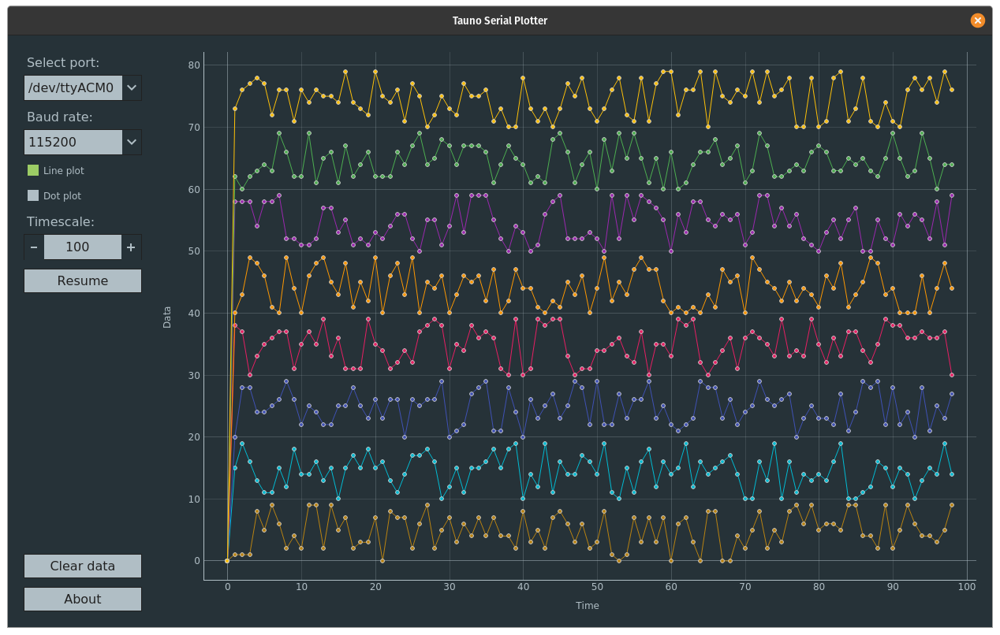
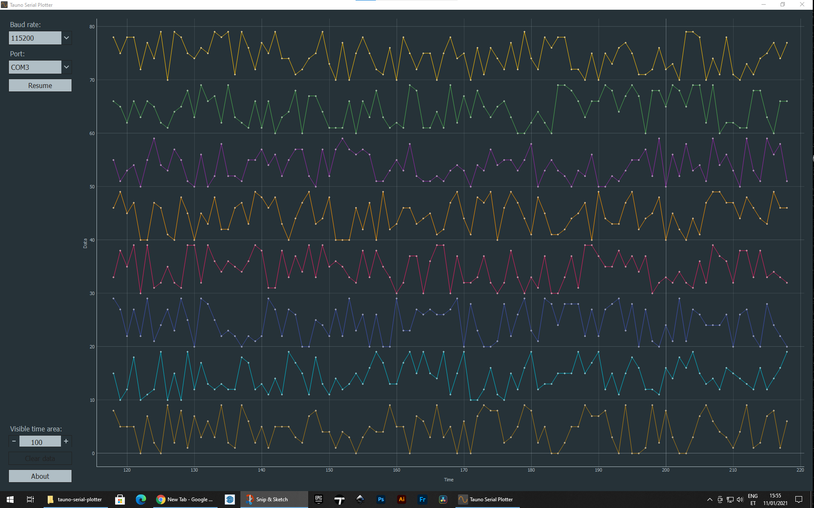

# Tauno Serial Plotter

Serial Plotter for Arduino and other embedded devices.

Incoming data should be string. Ending with new line character. Numbers (int and float) can be separated with almost any character.
Like:

    label2la15be17el28/31/42/54 78

or

    a2b1.5c1.7d2.8/3.1/4.2/5.4 7.8

But not with **-** unless it is a negative number:

    5-10-22-33-40-55-62-75

Script will extracts all numbers and generate graph.

Tested on Ubuntu 20.10.

And on Windows 10

## Requirements

Requirements if you use python script to run it. On Windows 10 it is easier to download zip file and run from it. On Linux use [Snapcraft](https://snapcraft.io/tauno-serial-plotter).

Python 3.7, PyQt5, pyserial, pyqtgraph

    $ sudo apt install python3-pip python3-pyqt5

    $ pip3 install pyserial pyqtgraph

## dialout group
In order to access USB devices on Linux, you need to add your user to the dialout group. Open a terminal window, run the following command and reboot your computer.

    $ sudo usermod -a -G dialout $USER

## udev.rules

Linux users have to install 99-platformio-udev.rules to accesse serial devices.

    $ curl -fsSL https://raw.githubusercontent.com/platformio/platformio-core/master/scripts/99-platformio-udev.rules | sudo tee /etc/udev/rules.d/99-platformio-udev.rules

Restart “udev” management tool:

    $ sudo service udev restart

More info: https://docs.platformio.org/en/latest/faq.html#faq-udev-rules

## Run
    $ cd src/
    
    $ chmod +x tauno-serial-plotter.py

    $ ./tauno-serial-plotter.py

or 

    $ python3 ./tauno-serial-plotter.py

## Diffrent ways to build

 - [Build with fbs](doc/Build-fbs.md) (Windows, Linux)
 - [Build with snapcraft](doc/Build-snap.md) (Linux)
 - [Build with flatpak](doc/Build-flatpak.md) (Linux)
 - [Build with PyInstaller](doc/pyinstaller.md) (Windows, Linux, Mac)
 
 ___

Copyright 2021 Tauno Erik https://taunoerik.art
