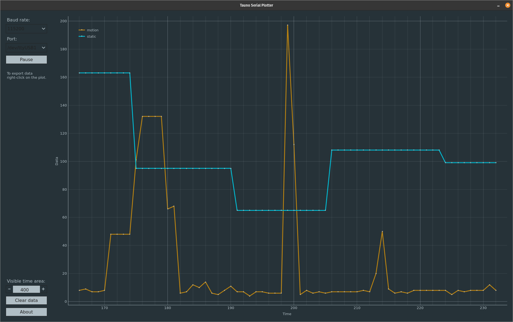
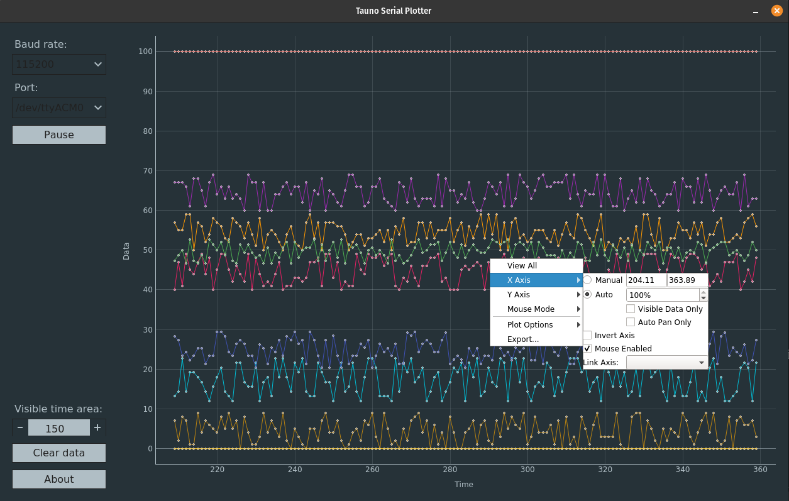

# Tauno Serial Plotter
[](https://snapcraft.io/tauno-serial-plotter)
[](https://lgtm.com/projects/g/taunoe/tauno-serial-plotter/context:python)

[](https://snapcraft.io/tauno-serial-plotter)

[](https://flathub.org/apps/details/art.taunoerik.tauno-serial-plotter)

Serial Plotter for Arduino and other embedded devices.

Windows version can be found under [Releases](https://github.com/taunoe/tauno-serial-plotter/releases). (TODO: Update it!)

## Features

- Simple user interface
- Plotting of multiple variables, with different colors for each
- Can plot both integers and floats
- Can plot negative values
- Auto-scrolls the Time scale (X axis)
- Auto-resizes the Data scale (Y axis)

## Data

Incoming data should be string. Ending with new line character. Numbers (int and float) can be separated with almost any character.
Like:

    label2la15be17el28/31/42/54 78

or

    a2b1.5c1.7d2.8/3.1/4.2/5.4 7.8

But not with **-** unless it is a negative number:

    5-10-22-33-40-55-62-75

Script will extracts all numbers and generate graph.

## Example Arduino code

```C++
Serial.print(variable1);
Serial.print(",");
Serial.print(variable2);
Serial.print(",");
Serial.println(last_variable);
```

To stop the plotter from auto-scaling add a 'min' and 'max' line.

```C++
Serial.print(variable1);
Serial.print(",");
Serial.print(variable2);
Serial.print(",");
Serial.println("Min:0,Max:1023");
```

## Screenshots

Tested on Ubuntu 20.10.



And on Windows 10


## Requirements

Requirements if you use python script to run it. On Windows 10 it is easier to download zip file and run from it. On Linux use [Snapcraft](https://snapcraft.io/tauno-serial-plotter).

Python 3.7, PyQt5, pyserial, pyqtgraph

    sudo apt install python3-pip python3-pyqt5

    pip3 install pyserial pyqtgraph

## Dialout group

In order to access USB devices on Linux, you need to add your user to the dialout group. Open a terminal window, run the following command and reboot your computer.

    sudo usermod -a -G dialout $USER

## udev.rules

Linux users have to install 99-platformio-udev.rules to accesse serial devices.

    curl -fsSL https://raw.githubusercontent.com/platformio/platformio-core/master/scripts/99-platformio-udev.rules | sudo tee /etc/udev/rules.d/99-platformio-udev.rules

Restart “udev” management tool:

    sudo service udev restart

More info: https://docs.platformio.org/en/latest/faq.html#faq-udev-rules

## Run

    cd src/
    
    chmod +x tauno-serial-plotter.py

    ./tauno-serial-plotter.py

or

    python3 ./tauno-serial-plotter.py

## Plot settings

Once the plot (graph) is created it is possible to change the additional plot settings. Like to disable auto-resize on x or-axis y-axis. Or to export data.

**Right-click** on the plot area.



## Diffrent ways to build

- [Build with fbs](doc/Build-fbs.md) (Windows, Linux)
- [Build with snapcraft](doc/Build-snap.md) (Linux)
- [Build with flatpak](doc/Build-flatpak.md) (Linux)
- [Build with PyInstaller](doc/pyinstaller.md) (Windows, Linux, Mac)

 ___

Copyright 2021 Tauno Erik https://taunoerik.art
